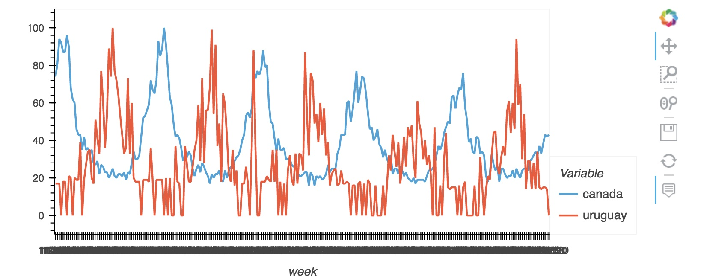
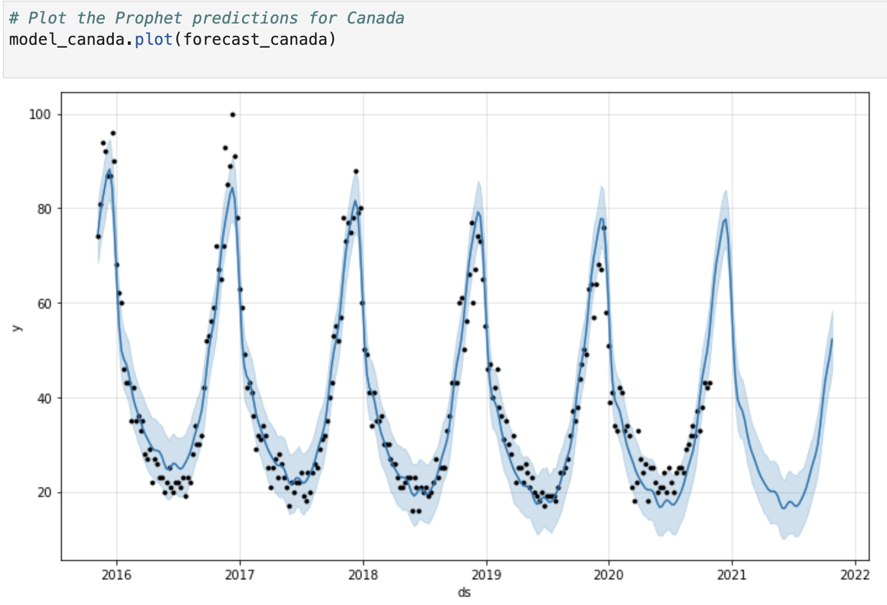
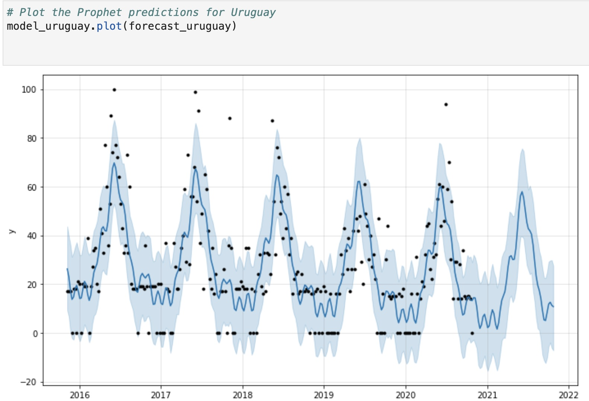
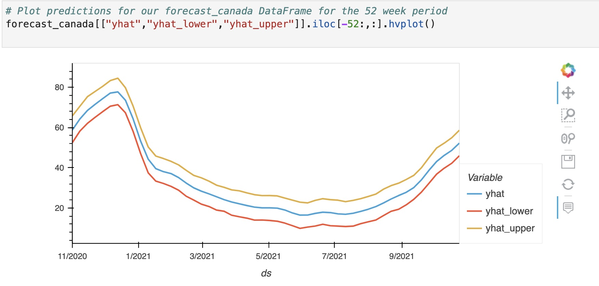
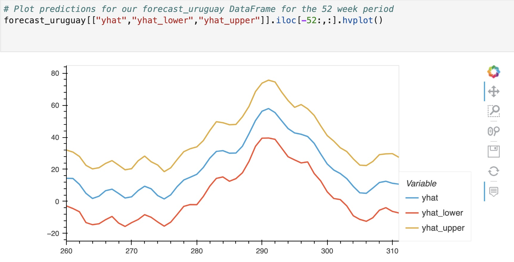
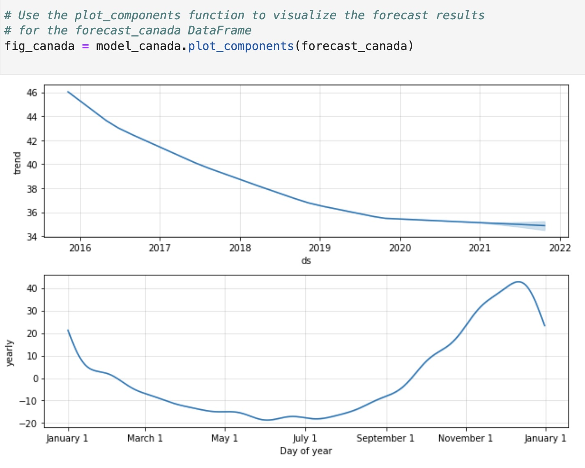
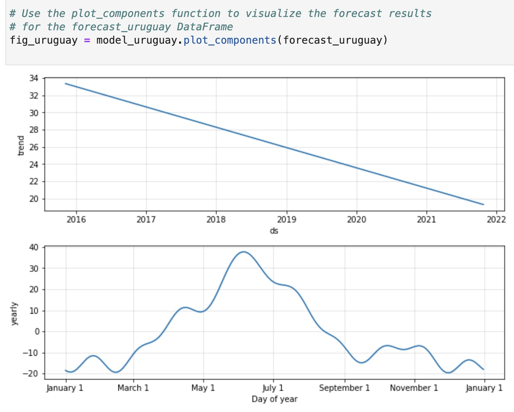

# Forecasting_Net_Prophet
Time series analysis  and  forecast interpretation for decision making with Prophet


### Project Overview:


we’re collaborating with the International Co-operative Alliance on a project. This will help alpaca farms in Vacaville, California that the Menagerie Hill Ranch indigenous people own to export alpaca wool scarves to different countries or regions. We’re asked to find the best season to sell scarves in Canada and Uruguay and to forecast the demand for scarves for one year.

We don’t have any idea about the scarf market in Canada and Uruguay. So, we got some data from Google Trends to figure out the optimal selling season.

In this project, I’ll use time series forecasting to analyze Google Trends data. The purpose will be to validate market opportunities to help the Menagerie Hill Ranch indigenous people in Vacaville, California export alpaca wool scarves to Canada and Uruguay.

we’ll continue collaborating with the International Co-operative Alliance. But now, I’ll use Prophet to validate prospective market opportunities

To accomplish this, I'll perform the following tasks:

1. Read the Google Trends data into a Pandas DataFrame, and then plot the general trends.

2. Prepare the data to fit the Prophet model. Create two new DataFrames: one for Canada and another for Uruguay.

3. Create two Prophet models, one for each country.

4. Fit the Prophet models.

5. Use the `make_future_dataframe` function to forecast one year of trend dates.


6. Predict the future trends data by using the `predict` method for both the Canada and Uruguay models. 

7. Plot Prophet’s predictions by using the `plot` function. Pass the forecasts for Canada and Uruguay, respectively, as the parameters. 

8. Analyze the forecast results by plotting the forecast DataFrame's “yhat”, “yhat_lower”, and “yhat_upper” columns for each the Canadian and Uruguay models. 

9. Use the `plot_component` function from the Prophet models to analyze the patterns of the Google Trends times series data for the Canada and Uruguay models.  

## Technologies
This project runs on python 3.7 and includes the following libraries and dependencies:

* pandas 
* holoviews 
* prophet 
* hvplot
* datetime 
* %matplotlib inline
* Jupyter Notebook

## Installation Guide

To use the application you need to install the following dependencies.

```python
!pip install pystan
!pip install prophet
!pip install hvplot
!pip install holoviews

``` 
---

### Usage

To use this application just clone the repository on your local macine and run the provided code in the Install and import the required libraries and dependencies section.

## Usage Examples

### General Search Trend in CANADA and URUGUAY



### Prophet’s predictions

#### Canada 





#### Uruguay 




### Forecast Analysis
#### Canada


The prophet forecast is showing an increased trend at the end of the year in December because of winter season in Canada. So, it might prove optimal to start marketing campaigns in August and start selling scarves by October.



In Uruguay since the climate is subtropical, with mild winters (from June to August), an increased trend can be seen around that period and as per prophet will reamain the same. So, it might prove optimal to start marketing campaigns in December and start selling scarves by April.

### Pattern Analysis of Google Trends Time Series Data

### Canada


The first plot indicates a long-term downward trend in the search trend over the last five or six years. But, short-term patterns also exist for us to discover. For example, the second plot indicates that the people search less from May to July as the weather is warm but again it starts to rise from August and at it's peak in Novemberin winter.


### Uruguay


For Uruguay, there is a long term downward trend in the last six years.People are searching less.The yearly trend as depicted by the plot tells us that people start looking for winter cloths as March approaches at highest time is June.After that it starts to decline until September because Uruguay experiances hot summers (from December to March).

#### Conclusion

In conclusion, we used Prophet to analyze search trend in Canada and Uruguay. The purpose was to validate market opportunities to help the Menagerie Hill Ranch indigenous people in Vacaville, California export alpaca wool scarves to Canada and Uruguay.We were asked to find the best season to sell scarves in Canada and Uruguay and to forecast the demand for scarves for one year.

From our analysis it can be concluded that in Canada it might prove optimal to start marketing campaigns in August and start selling scarves by October.And in Uruguay they should start marketing campaigns in December and start selling scarves by April.


## Contributers:

Manisha Lal

12/05/2022

manisha.lal.2009@gmail.com
___


## License

copyright@2022

